# Authentication Gateway

A standalone identity and token-issuance service built with **NestJS 11 (Express adapter)**, **TypeScript**, **PostgreSQL**, **Prisma**, **JWT**, and **bcrypt**.

> Developed by **Ahmed Medhat**

**Project type:** Web application (university capstone)
**License:** Proprietary — All rights reserved

---
## Table of Contents
1. [Overview](#overview)
2. [SDLC Framework](#sdlc-framework)
3. [Design Phases](#design-phases)
4. [Project Status](#project-status)
5. [Getting Started](#getting-started)
   - [Prerequisites](#prerequisites)
   - [Setup](#setup)
   - [Environment Variables](#environment-variables)
   - [Scripts](#scripts)
6. [Project Structure](#project-structure)
7. [Tech Stack](#tech-stack)
8. [Architecture](#architecture)
   - [System Context](#system-context)
   - [Module Map](#module-map)
   - [Component Architecture](#component-architecture)
   - [Request Lifecycle](#request-lifecycle)
9. [API Design](#api-design)
   - [API Endpoints](#api-endpoints)
10. [Database Design](#database-design)
11. [Security Design](#security-design)
    - [Security Model](#security-model)
    - [Cross-Cutting Concerns](#cross-cutting-concerns)
    - [Trust Boundaries](#trust-boundaries)
12. [Workflows](#workflows)
    - [User Registration](#1-user-registration)
    - [Email Verification](#2-email-verification)
    - [Login](#3-login)
    - [Access Token Usage — Authenticating a Protected Request](#4-access-token-usage--authenticating-a-protected-request)
    - [Authorization (RBAC)](#5-authorization-rbac)
    - [Refresh Token Flow](#6-refresh-token-flow)
    - [Logout Sequence](#7-logout-sequence)
    - [Password Change](#8-password-change)
    - [Forgot Password / Reset](#9-forgot-password--reset)
    - [Rate Limiting](#10-rate-limiting)
    - [Audit Logging](#11-audit-logging)
    - [Health Check](#12-health-check)
13. [Testing](#testing)
14. [License](#license)

---
## Overview
The Authentication Gateway is a complete, self-contained identity and token-issuance service: registration, login, refresh-token rotation with reuse detection, logout, password change, email verification, password reset, JWT and RBAC authorization, rate limiting, audit logging, a standard error envelope, security headers, CORS, and health checks. All code compiles, lint is clean, and the full test suite passes.

It is a learning project for backend engineering, not a production identity provider. Docker, Redis, Argon2, Swagger/OpenAPI, CI/CD, and a microservices split are deliberately out of scope so the project stays focused on application-level design.

## SDLC Framework
**Iterative and incremental development using vertical slices, executed with a risk-first mindset and enforced by quality gates.** Each feature was designed, implemented, tested, security-reviewed, and documented before the next began — no phase was skipped because the previous one "looked finished."

This framework was chosen over the alternatives considered: Waterfall (too rigid, pushes security and testing to the end), Scrum (built for teams; ceremony overhead not justified for a solo project), Spiral (too much risk-analysis documentation for this scale), V-Model (too linear for exploratory backend work), and Kanban (optimized for steady-state operations, not a greenfield build).

## Design Phases
Before writing code, seven design phases were completed: Discovery and Scope, SDLC Planning, System Design, Architecture, Database Design, API Design, and Security Design. Key decisions from those phases that every later step inherited:

- **Architecture** — modular monolith. Domain modules (Auth, User, Token, Role, Audit, Health) plus infrastructure modules (Prisma, Mailer, Config, Hasher). Dependencies point inward; controllers stay thin; services own business logic.
- **Database** — nine models with explicit keys, constraints, indexes, and foreign-key behaviors. Token tables store hashes only. Audit rows survive user deletion via `SET NULL`.
- **API** — versioned under `/api/v1`. Standard error envelope with a stable error code and a `requestId`. Auth actions grouped under `/auth`. No `/users/:id` route — ID-based user lookup by another user is impossible by design.
- **Security** — threat model built with STRIDE and mapped against the OWASP Top 10; every control follows a threat → vulnerability → mitigation → implementation chain.

## Project Status
| Area | Status |
|---|---|
| Config module (Joi validation, fail-fast boot) | Done |
| Hasher module (bcrypt wrapper) | Done |
| Prisma module (typed client, connection lifecycle) | Done |
| Mailer module (port with fake and SMTP adapters) | Done |
| Audit module (append-only security event log) | Done |
| Token module (access + refresh, rotation, family revocation) | Done |
| User module (UserService, email normalization) | Done |
| Role module (roles, permissions, admin operations) | Done |
| Auth endpoints (register, login, refresh, logout, change-password, verify-email, forgot-password, reset-password) | Done |
| JWT auth guard (global, opt-out via `@Public()`) | Done |
| RBAC permissions guard (opt-in via `@RequirePermission`) | Done |
| Email-verified guard (opt-in via `@RequireVerifiedEmail`) | Done |
| `GET /users/me` | Done |
| Admin role endpoints (list, assign, revoke, last-admin protection) | Done |
| Health checks (`/live`, `/ready`) | Done |
| Rate limiting (strict on register / forgot-password) | Done |
| Global exception filter (standard error envelope) | Done |
| Security headers (helmet) | Done |
| CORS allowlist | Done |
| Request-ID interceptor (log correlation) | Done |
| Full `docs/` folder with ADRs | Not started |

## Getting Started
### Prerequisites
- Node.js 20+ and npm
- PostgreSQL 15+ running locally or accessible via connection string

### Setup
```bash
# 1. Clone the repository
git clone <repository-url>
cd authentication-gateway

# 2. Install dependencies
npm install

# 3. Copy the environment template and fill in DATABASE_URL and JWT_SECRET
cp .env.example .env

# 4. Generate a JWT secret and paste it into .env
node -e "console.log(require('crypto').randomBytes(48).toString('base64url'))"

# 5. Apply database migrations
npx prisma migrate dev

# 6. (Optional) Seed reference/test data
npx ts-node prisma/seed.ts

# 7. Start the development server
npm run start:dev
```

The API is available at `http://localhost:3000`.

### Environment Variables
| Variable | Required | Description |
|---|---|---|
| NODE_ENV | no | development, production, or test. Defaults to development. |
| PORT | no | HTTP port. Defaults to 3000. |
| DATABASE_URL | yes | PostgreSQL connection string. |
| JWT_SECRET | yes | Minimum 32 characters. Signs and verifies JWTs (HS256). |
| JWT_ACCESS_EXPIRES_IN | no | Access token lifetime. Defaults to 15m. |
| JWT_REFRESH_EXPIRES_IN | no | Refresh token lifetime. Defaults to 7d. |
| BCRYPT_COST | no | bcrypt cost factor between 10 and 15. Defaults to 12. |
| CORS_ORIGINS | no | Comma-separated allowed origins. |
| MAIL_DRIVER | no | fake or smtp. Defaults to fake. |
| MAIL_FROM | no | Sender address for outgoing email. |

### Scripts
| Script | Description |
|---|---|
| build | Compile the project with `nest build`. |
| format | Format `src/` and `test/` with Prettier. |
| start | Run the compiled application. |
| start:dev | Run the application in watch mode. |
| start:debug | Run in watch mode with the Node debugger attached. |
| start:prod | Run the production build (`dist/main`). |
| lint | Run ESLint with autofix. |
| test | Run unit tests. |
| test:watch | Run unit tests in watch mode. |
| test:cov | Run unit tests with coverage. |
| test:debug | Run unit tests with the Node debugger attached. |
| test:e2e | Run end-to-end tests (`test/jest-e2e.json`). |

Prisma commands (`migrate dev`, `generate`, `studio`) are run directly with `npx prisma <command>`; there are no npm script wrappers for them.

## Project Structure
```bash
authentication-gateway/
├── .env
├── .env.example
├── package.json
├── tsconfig.json
│
├── prisma/
│   ├── schema.prisma
│   ├── seed.ts
│   └── migrations/
│       ├── 20260917085801_init/
│       └── 20260917163916_add_auth_models/
│
├── public/
│   ├── db/
│   │   └── erd.png
│   └── designs/
│       ├── component-architecture.png
│       ├── module-map.png
│       ├── request-lifecycle.png
│       ├── system-context.png
│       ├── auth/
│       │   ├── authorization-flow (rbac).png
│       │   └── logout-sequence.png
│       └── security/
│           ├── security-boundaries.png
│           └── trust-boundaries.png
│
├── src/
│   ├── main.ts
│   ├── app.module.ts
│   ├── app.controller.ts
│   ├── app.service.ts
│   │
│   ├── audit/
│   │   ├── audit-event.enum.ts
│   │   ├── audit.module.ts
│   │   └── audit.service.ts
│   │
│   ├── auth/
│   │   ├── auth.controller.ts
│   │   ├── auth.module.ts
│   │   ├── auth.service.ts
│   │   ├── decorators/
│   │   │   ├── current-user.decorator.ts
│   │   │   ├── public.decorator.ts
│   │   │   ├── require-permission.decorator.ts
│   │   │   └── require-verified-email.decorator.ts
│   │   ├── dto/
│   │   │   ├── change-password.dto.ts
│   │   │   ├── forgot-password.dto.ts
│   │   │   ├── login.dto.ts
│   │   │   ├── logout.dto.ts
│   │   │   ├── refresh.dto.ts
│   │   │   ├── register.dto.ts
│   │   │   ├── reset-password.dto.ts
│   │   │   └── verify-email.dto.ts
│   │   ├── guards/
│   │   │   ├── email-verified.guard.ts
│   │   │   ├── jwt-auth.guard.ts
│   │   │   └── permissions.guard.ts
│   │   ├── strategies/
│   │   │   └── jwt.strategy.ts
│   │   └── types/
│   │       └── authenticated-user.ts
│   │
│   ├── common/
│   │   ├── config/cors.config.ts
│   │   ├── decorators/throttle.decorators.ts
│   │   ├── filters/http-exception.filter.ts
│   │   ├── interceptors/request-id.interceptor.ts
│   │   ├── middleware/security-headers.middleware.ts
│   │   └── types/request-context.ts
│   │
│   ├── config/
│   │   └── validation.schema.ts
│   │
│   ├── hasher/
│   │   └── hasher.service.ts
│   │
│   ├── health/
│   │   ├── health.controller.ts
│   │   ├── health.module.ts
│   │   └── health.service.ts
│   │
│   ├── mailer/
│   │   ├── fake-mailer.adapter.ts
│   │   ├── mailer.module.ts
│   │   ├── mailer.port.ts
│   │   └── smtp-mailer.adapter.ts
│   │
│   ├── prisma/
│   │   ├── prisma.module.ts
│   │   └── prisma.service.ts
│   │
│   ├── role/
│   │   ├── admin.controller.ts
│   │   ├── role.module.ts
│   │   ├── role.service.ts
│   │   └── dto/
│   │       ├── assign-role.dto.ts
│   │       └── revoke-role.dto.ts
│   │
│   ├── token/
│   │   ├── token.module.ts
│   │   └── token.service.ts
│   │
│   └── users/
│       ├── user.controller.ts
│       ├── user.module.ts
│       └── user.service.ts
│
└── test/
    ├── jest-e2e.json
    ├── admin-roles.e2e-spec.ts
    ├── auth.e2e-spec.ts
    ├── auth-change-password.e2e-spec.ts
    ├── auth-email-verified.e2e-spec.ts
    ├── auth-login.e2e-spec.ts
    ├── auth-logout.e2e-spec.ts
    ├── auth-password-reset.e2e-spec.ts
    ├── auth-refresh.e2e-spec.ts
    ├── auth-users-me.e2e-spec.ts
    ├── auth-verify-email.e2e-spec.ts
    └── security.e2e-spec.ts
```

`.spec.ts` files colocated with their source (unit tests) are omitted above for readability; see [Testing](#testing) for coverage.

## Tech Stack
| Layer | Choice |
|---|---|
| Framework | NestJS 11, Express adapter |
| Language | TypeScript 5 (strict mode) |
| Database | PostgreSQL 15 |
| ORM | Prisma 6 |
| Auth | `@nestjs/jwt` 11, Passport 10, `passport-jwt` |
| Password hashing | bcrypt |
| Config validation | Joi |
| Security headers | helmet |
| Rate limiting | `@nestjs/throttler` 6 |
| Email | Nodemailer (fake adapter for dev/test, SMTP adapter for real delivery) |
| Validation | class-validator, class-transformer |
| Testing | Jest, Supertest |
| Tooling | ESLint, Prettier, Git with Conventional Commits |

Excluded by design: Docker, Redis, Argon2, Swagger/OpenAPI, CI/CD, microservices.

## Architecture
The system is a **modular monolith**. Domain modules (Auth, User, Token, Role, Audit, Health) sit alongside infrastructure modules (Prisma, Mailer, Config, Hasher). Dependencies point inward — controllers depend on services, services depend on Prisma — and never the reverse. Controllers stay thin; services own business logic. Cross-cutting concerns (validation, authentication, authorization, error handling) use NestJS primitives: guards, pipes, interceptors, and filters.

### System Context


### Module Map
Modules are organized by domain responsibility, not by technical layer. Each module owns its data and exposes a narrow public API.


### Component Architecture


**Module responsibilities:**
| Module | Responsibility |
|---|---|
| Auth Module | Orchestrates registration, login, refresh, logout, password, and verification use cases |
| User Module | Profile read (`GET /users/me`) |
| Role Module | Roles, permissions, and admin role management |
| Token Module | Signs/verifies JWTs; manages refresh-token records, rotation, and family revocation |
| Mailer Module | Sends verification, password-reset, and other transactional email (fake or SMTP) |
| Audit Module | Persists security-relevant events (login, logout, password change, etc.) |
| Health Module | Liveness/readiness checks, DB connectivity probe |
| Guards | `JwtAuthGuard` (global authentication), `PermissionsGuard` (RBAC), `EmailVerifiedGuard` |
| Filters | `HttpExceptionFilter` — standard error envelope |
| Interceptors | `RequestIdInterceptor` — log correlation |
| Pipes | Request validation via DTOs (`class-validator`) |

### Request Lifecycle
NestJS's **actual** execution order (Express adapter) for an incoming request:


**Note on order:** Guards run *before* Interceptors and Pipes — a common misconception is that Pipes run first. The real order is: **Middleware → Guards → Interceptors (pre-controller) → Pipes → Route Handler → Interceptors (post-controller) → Exception Filters** (filters short-circuit the pipeline whenever an exception is thrown, from any stage).

## API Design
- All routes are versioned under `/api/v1`.
- Errors follow a standard envelope: a stable error code plus a `requestId` for correlation with server-side logs (see the [Request-ID interceptor](#cross-cutting-concerns) and the global exception filter).
- Auth-related actions are grouped under `/auth`.
- There is no `/users/:id` route — a user can only ever read or modify their own record via `/users/me`, making ID-based lookup of another user impossible by design (no IDOR surface).

### API Endpoints
| Method | Path | Auth required | Description |
|---|---|---|---|
| POST | /api/v1/auth/register | no | Register a new user. |
| POST | /api/v1/auth/login | no | Authenticate and issue an access/refresh token pair. |
| POST | /api/v1/auth/refresh | refresh token | Rotate the refresh token and issue a new access token. Reuse of a revoked token revokes the whole token family. |
| POST | /api/v1/auth/logout | yes | Revoke the current refresh token. |
| PATCH | /api/v1/auth/change-password | yes | Change the authenticated user's password and revoke existing refresh tokens. |
| GET | /api/v1/auth/verify-email | verification token | Verify email ownership via a single-use token. |
| POST | /api/v1/auth/forgot-password | no | Issue a password-reset token by email (no user enumeration). |
| POST | /api/v1/auth/reset-password | reset token | Set a new password via a single-use reset token. |
| GET | /api/v1/users/me | yes | Return the authenticated user's profile. |
| GET / POST | /api/v1/admin/roles/... | yes (admin) | List, assign, and revoke roles; last-admin protection prevents removing the final admin. |
| GET | /api/v1/health/live | no | Liveness probe. |
| GET | /api/v1/health/ready | no | Readiness probe, includes database connectivity check. |

Exact sub-paths under `/api/v1/admin/roles` should be confirmed against `admin.controller.ts`; everything else reflects the controller and DTO structure under [Project Structure](#project-structure).

## Database Design
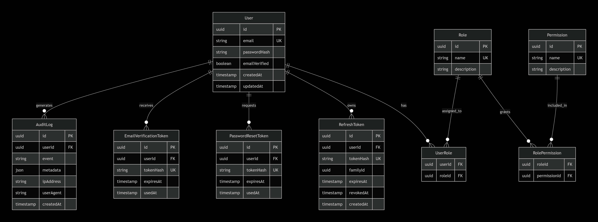

The Prisma schema defines nine models: `User`, `Role`, `Permission`, `UserRole`, `RolePermission`, `RefreshToken`, `EmailVerificationToken`, `PasswordResetToken`, and `AuditLog` — with explicit keys, constraints, and indexes. Token tables store hashes only, never raw token values. `AuditLog` rows survive user deletion via `SET NULL`, so security history isn't lost when an account is removed.

**Cardinality notes:**
1. User ↔ Role is many-to-many, through `UserRole`.
2. Role ↔ Permission is many-to-many, through `RolePermission`.
3. User → RefreshToken is one-to-many.
4. User → EmailVerificationToken and User → PasswordResetToken are one-to-many.
5. User → AuditLog is one-to-many, nullable on the user side (e.g. a failed login on an unknown email).

Two migrations are currently applied: the initial schema and a follow-up adding the auth-related models.

## Security Design
The threat model was built with **STRIDE** and cross-checked against the **OWASP Top 10**; each control traces a threat → vulnerability → mitigation → implementation chain.

### Security Model
- Passwords are hashed with bcrypt; cost factor is configurable and validated at startup.
- High-entropy tokens (refresh, email verification, password reset) are hashed with SHA-256 before storage; raw token values are never stored or logged.
- Access tokens are JWTs signed with HS256, verified through a Passport JWT strategy — no database round-trip on the hot path.
- Refresh tokens are rotated on every use. Reuse of an already-revoked refresh token revokes the entire token family for that user, forcing re-authentication.
- **Default-deny authorization**: the JWT auth guard is registered globally; routes opt out explicitly with `@Public()` rather than opting in to protection.
- RBAC is enforced by a permissions guard, opt-in per route via `@RequirePermission`; an email-verification guard is opt-in via `@RequireVerifiedEmail`.
- **Fail-fast configuration**: the app refuses to boot on missing or weak environment variables (validated with Joi).
- **No speculative abstraction**: Prisma is the only data-access layer — no generic repository interface sitting in front of a single implementation.

### Cross-Cutting Concerns
- Security headers via helmet.
- CORS allowlist sourced from configuration (`CORS_ORIGINS`).
- Rate limiting via `@nestjs/throttler`, with strict limits on `/auth/register` and `/auth/forgot-password` and relaxed defaults elsewhere. This uses in-memory tracking, appropriate for a single-instance deployment; a shared store would be needed to rate-limit correctly across multiple instances, which is out of scope here.
- A request-ID interceptor tags each request for log correlation.
- A global exception filter produces the standard error envelope; full error detail is logged server-side, but clients never see stack traces.

### Trust Boundaries


**Controls at each boundary:**
1. **Client → Edge:** TLS (production), security headers, CORS allowlist, body size limit.
2. **Edge → Guards:** token verification with a pinned algorithm; rate limiting before any expensive work.
3. **Guards → Services:** authorization enforced before business logic runs.
4. **Pipes → Services:** whitelist DTOs, reject unknown fields (mass-assignment defense).
5. **Services → DB:** Prisma parameterization; least-privilege DB user.
6. **App → Secrets:** environment variables via the Config module; never logged.
7. **App → Logs:** structured, sanitized; never tokens or passwords.

## Workflows
### 1. User Registration
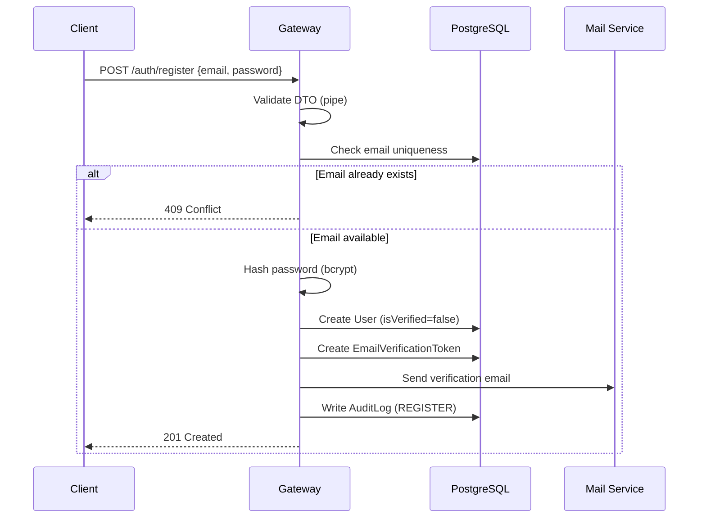

### 2. Email Verification
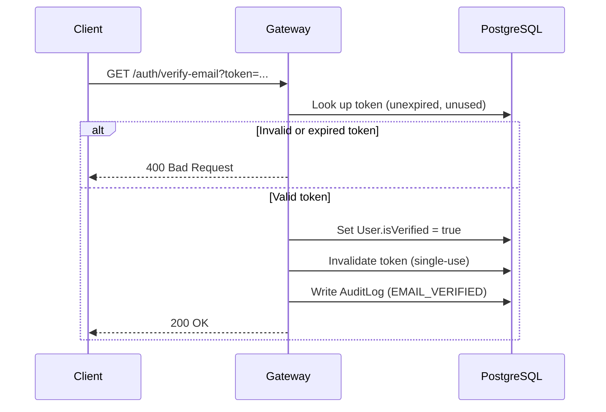

### 3. Login
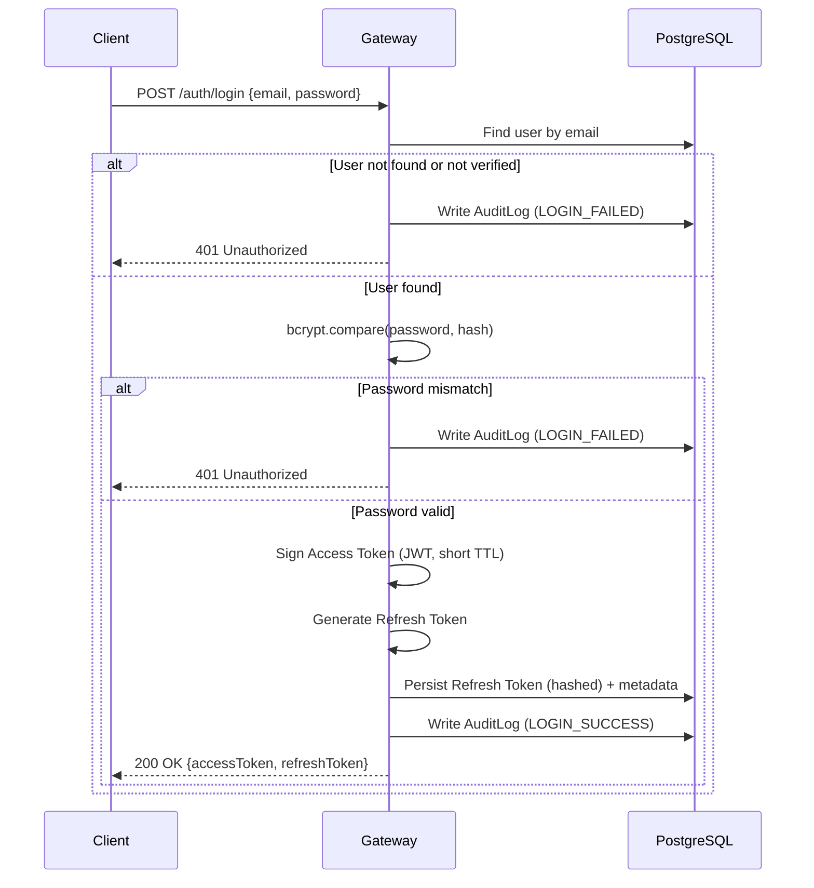

### 4. Access Token Usage — Authenticating a Protected Request
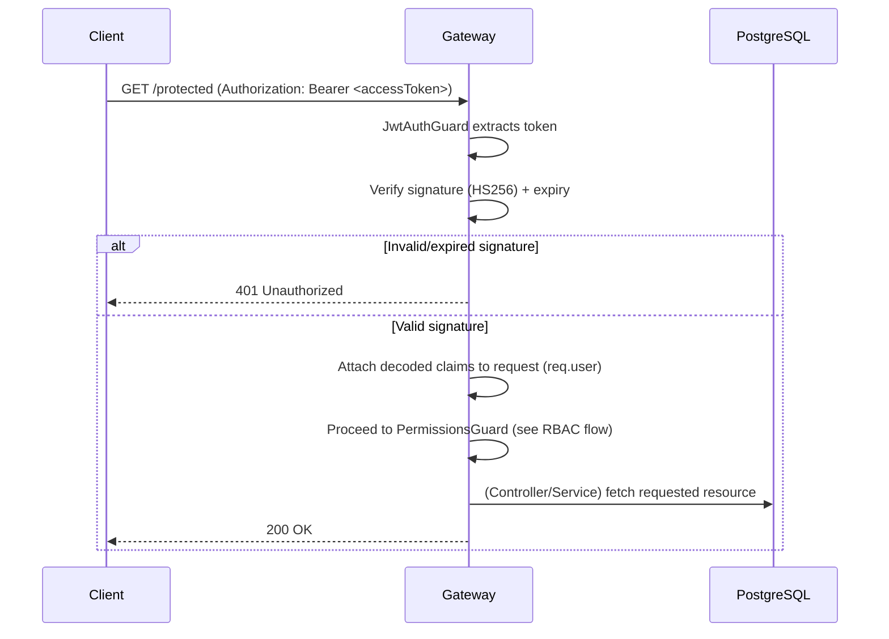

> Access tokens are validated **without a DB round-trip** (stateless) — this keeps the hot path fast. Revocation only affects refresh tokens; a compromised access token remains valid until its short TTL expires (mitigation: keep TTL ≤ 15 min).

### 5. Authorization (RBAC)
.png)

### 6. Refresh Token Flow
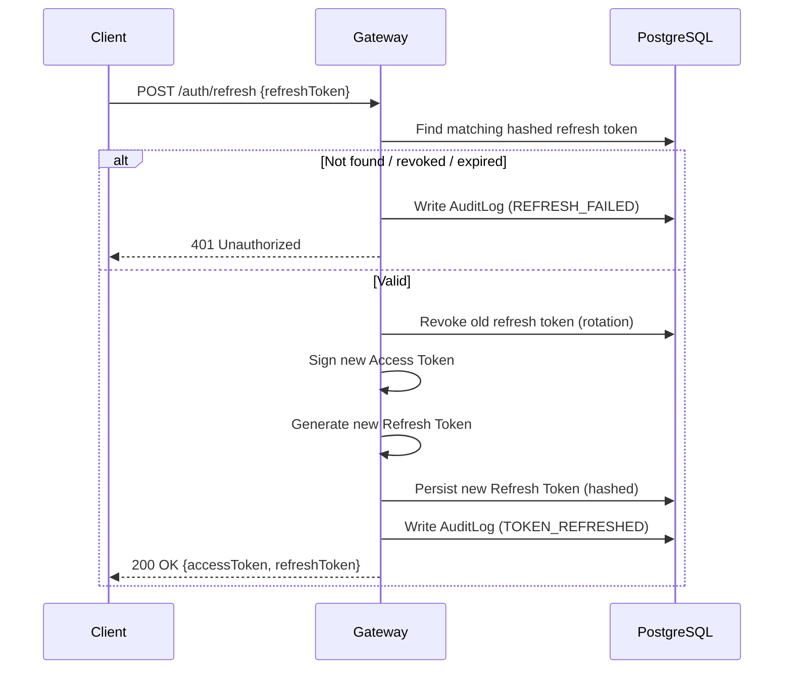

> **Rotation with reuse detection**: if a *revoked* refresh token is presented again, treat it as a stolen-token signal — revoke the entire token family for that user and force re-login.

### 7. Logout Sequence


### 8. Password Change
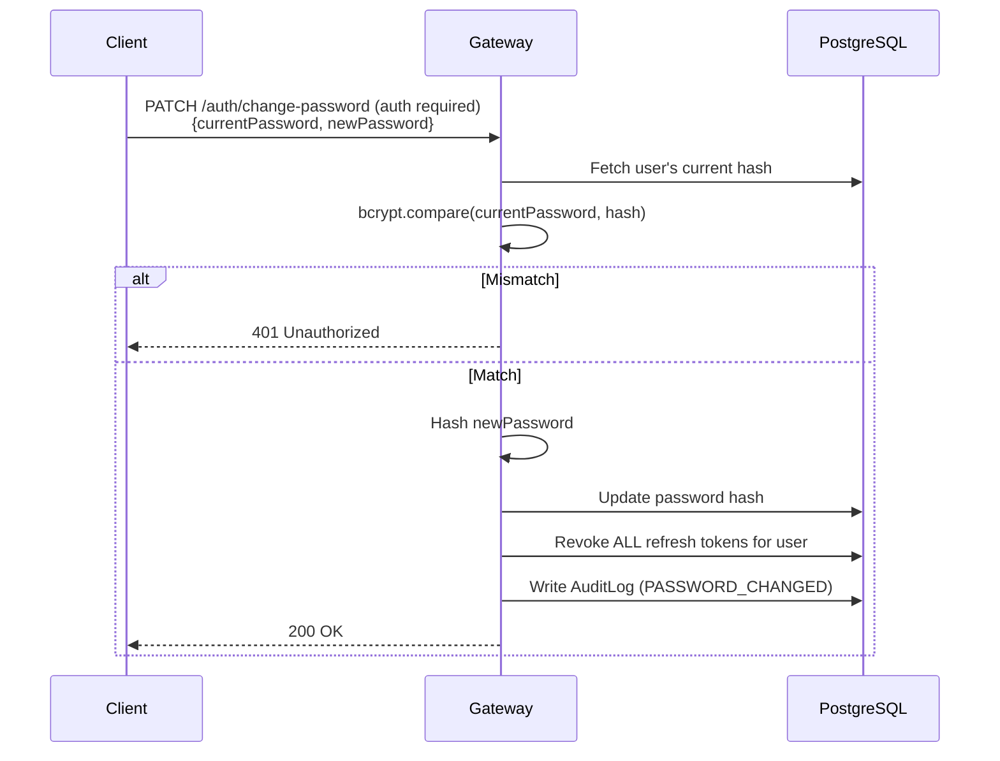

### 9. Forgot Password / Reset
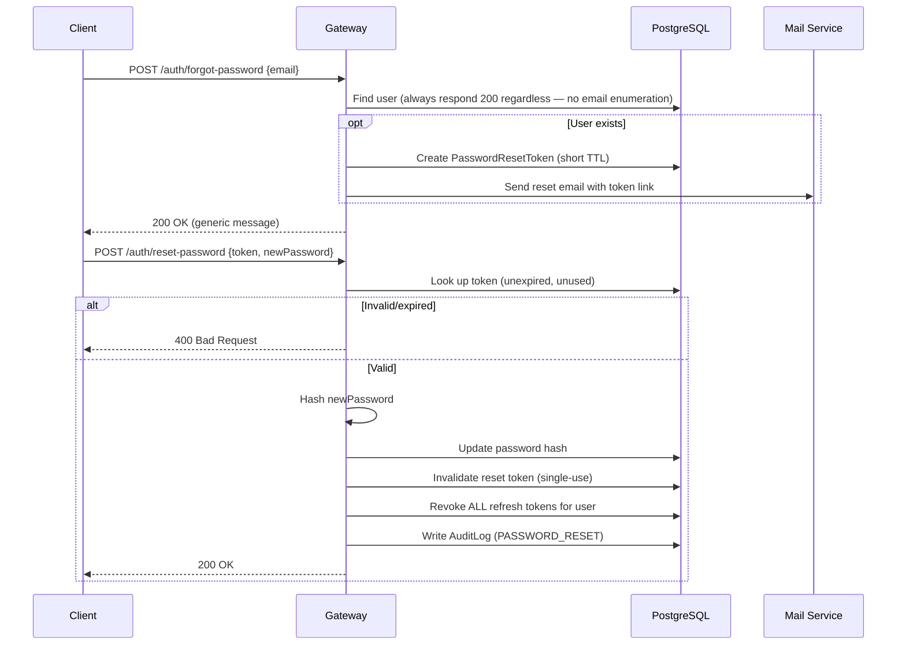

### 10. Rate Limiting
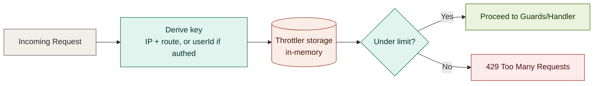

> Applied per-route with different thresholds: strict on `/auth/register` and `/auth/forgot-password`; relaxed elsewhere. Uses `@nestjs/throttler`'s in-memory store, verified manually (five 201 responses, then a 429). A shared store would be required to rate-limit correctly across multiple horizontally scaled instances — out of scope for this project.

### 11. Audit Logging
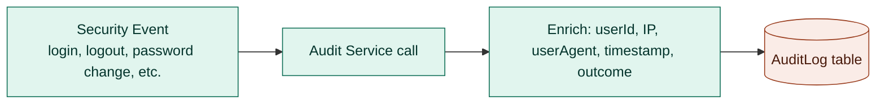

> `AuditLog.userId` is nullable and set to `NULL` on user deletion, so audit history outlives the account it describes.

### 12. Health Check
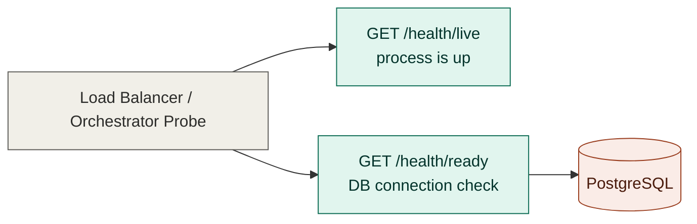

## Testing
- **Unit tests:** 26 tests across Config, Hasher, User, the exception filter, and the email-verified guard.
- **End-to-end tests:** 42 tests across 11 files, covering registration, login, refresh rotation and reuse detection, logout idempotency, change-password with session revocation, email verification, password reset, `GET /users/me`, admin role endpoints, the email-verified guard, and security headers/CORS.
- **Rate limiting:** verified manually against a running dev server (five `201` responses, then `429`) — not covered by an automated test.
- Approach: e2e tests hit the real database and real HTTP layer; unit tests cover pure logic only. Each e2e file seeds the data it needs and cleans up after itself; the suite runs serially to avoid cross-file interference.

All tests pass; lint is clean.

## License
Proprietary — All rights reserved. Declared as `"license": "UNLICENSED"` in `package.json`.

This project is a university capstone project. This software and associated documentation are proprietary and confidential. No part may be reproduced, distributed, or transmitted in any form without prior written permission from the author.